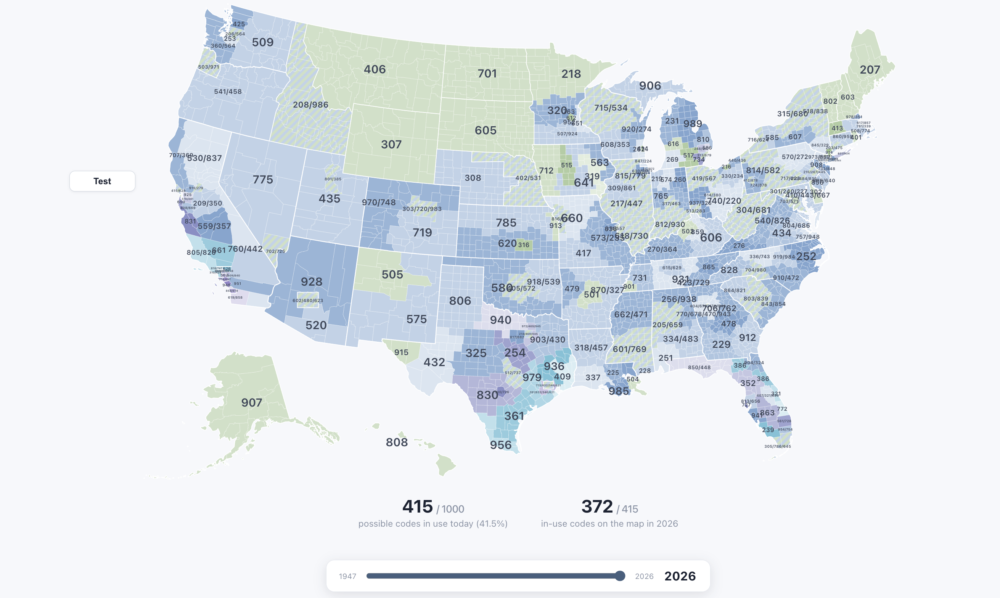

# Map of US Area Code History



## Run

```sh
npm i
npm run dev
```

## FAQ

**What is this?**

This is a map of all US area codes over time, starting from the original numbering plan in the 1940s until 2026. The boundaries are not exact, and the timeline may be fuzzy. Its purpose was to help memorize the current area codes in use. It was vibecoded by Fable 5 for roughly $225 of credits. Almost none of it has been verified as accurate, although it looks about right.

**What the hell is happening in Chicago?**

idk

**What is wrong with LA?**

you tell me

**I can't see LA**

If you hold Z and click you can zoom in further.
